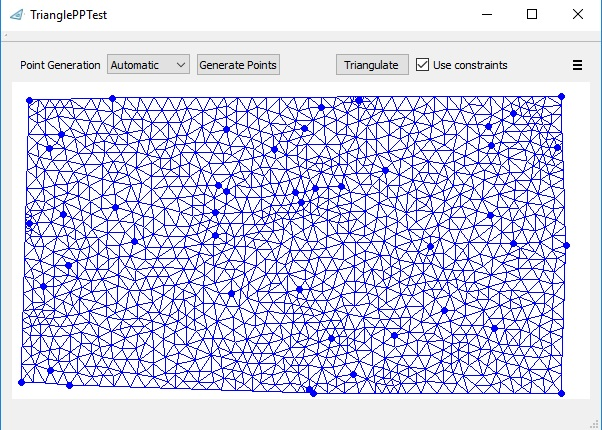
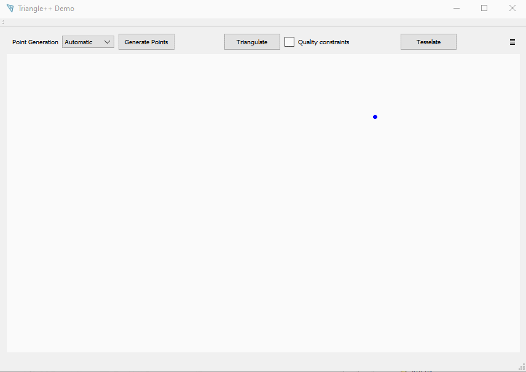

# Triangle++
[comment]: # "  "
 *Triangle++* (aka *TrianglePP*) is a C++ wrapper for the original J.P. Shevchuk's 2005 C-language *Triangle* package.

It can create standard **Delaunay** triangulations and their duals, i.e. **Voronoi** diagrams (aka Dirichlet tessellations). 

Additionally it can generate:
 1. **quality Delaunay** triangulations (where we can set bounds on the areas and angles of the resulting triangles) 
 2. **constrained Delaunay** triangulations (where we can connect some points with and edge and require that this edge will be part of the result) 

Constrained Delaunay triangulation opens up some very interesting possibilities - it allows us to triangulate polygons even with other polygons inside them. These embedded polygons can be also marked as **holes** and excluded from triangulation. On top of this, we can even set the triangulation constraints! See below in the **Demo App** section for some screenshots illustrating that.
Moreover, support for saving and reading **point and polygon files** is available.

This code is released under LPGL licence.

## Usage:

For usage patterns see the examples in the *trpp_example.cpp* source file. The interface of the *trpp*-wrapper is defined in the *tpp_inteface.hpp* header file. A (very) basic usage example is shown in the code snippet below:

    // prepare input
    std::vector<Delaunay::Point> delaunayInput;
    
    delaunayInput.push_back(Delaunay::Point(0,0));
    delaunayInput.push_back(Delaunay::Point(1,1));
    delaunayInput.push_back(Delaunay::Point(0,2));
    delaunayInput.push_back(Delaunay::Point(3,3));

    // use standard triangulation
    Delaunay trGenerator(delaunayInput);
    trGenerator.Triangulate();

    // iterate over triangles
    for (FaceIterator fit = trGenerator.fbegin(); fit != trGenerator.fend(); ++fit)
    {
        int vertexIdx1 = fit.Org(); 
        int vertexIdx2 = fit.Dest();
        int vertexIdx3 = fit.Apex();

        // access point's cooridinates: 
        double x1 = delaunayInput[vertexIdx1][0];
        double y1 = delaunayInput[vertexIdx1][1];
    }

For more examples consult the *docs* directory.

## Demo App:

Additionally, under *testappQt* you'll find a GUI programm to play with the triangulations:

quality triangulations:

constrained triangulations:

(also with holes!):

(also without enclosing convex hull):

and with tesselations/Voronoi diagrams:

You can also save and read your work:

and... move the points around!

## Original Triangle package

 

This code is a wrapper for the original 2005 J.P. Shevchuk's *Triangle* package that was written in old plain C. The library was a **winner** of the 2003 James Hardy Wilkinson Prize in Numerical Software (sic!).
For more information you can look at:
 - http://www.cs.cmu.edu/~quake/triangle.html
 - http://www.cs.cmu.edu/~quake/triangle.demo.html
 - README in the docs directory
 
## History

I started with Piyush Kumar's [C++/OO wrapper](https://bitbucket.org/piyush/triangle/overview) of the original *Triangle* code, ported it to Visual C++ (VisualStudio 2008/Win32), did some bugfixes, and extended the wrapper for constrainied triangulations and Voronoi diagrams. 
Then the code was ported to x64 Windows and Linux, *CMake* support (for both the example program and the GUI demonstrator) was added, as well as Catch2 unit test suite. 
Recently, support for reading and writing of *Triangle*'s file formats and input data sanitization were also added.

## TODOs:
 - remove warnings

 - decouple tpp::Delaunay from the reviver::dpoint<> class

 - add support for regions and reading of region attributes from .poly file
 - Add support for all options in constrained triangulations (Steiner point constraints, regions, etc) (???)
 - add support for saving Voronoi meshes in an .edge file
 - add support for saving triangulations as GLB files (Draco encoded?)

 - add support for refining of triangulations (?) 
 - add convex hull demonstration to the Qt demo app (??)
  
 - add CI support (Travis?)
 - Port the Qt demo app to Emscripten
