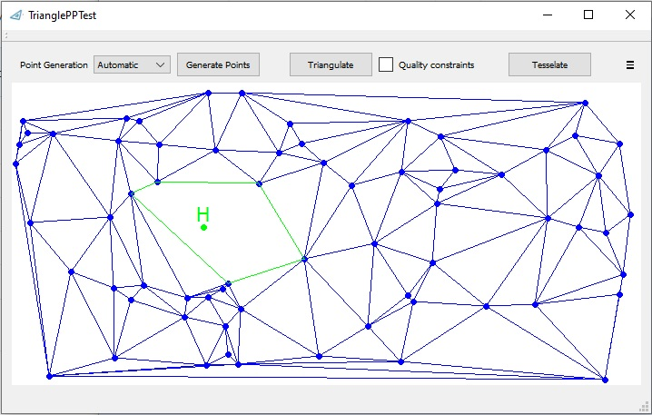
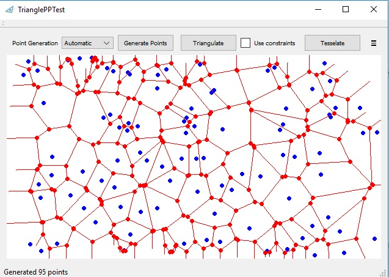

# Triangle++
[comment]: # "  "
 *Triangle++* (aka *TrianglePP*) is an updated version of Piyush Kumar's [C++/OO wrapper](https://bitbucket.org/piyush/triangle/overview) for the original 2005 J.P. Shevchuk's *Triangle* package that was written in old plain C.

It can create **Delaunay** triangulations, **constrained Delaunay** triangulations and **Voronoi** diagrams.

I have ported the original wrapper to Visual C++ (VC9, i.e. VisualStudio 2008), done some bugfixes, and extended it for constrainied triangulations ands Voronoi diagrams. 

This code is released under LPGL licence.

## Update:

The code is now preliminary ported to x64 Windows. The project file was updated to Visual Studio 2015/2019, the x64 target was added, and the asserts & crashes when running the example program were fixed. It **wasn't thorougly tested though**.

*CMake* support for both the example program and the GUI demonstrator were added too recently. They are running both on Linux and Windows.

## Usage:

For usage patterns see the examples in the *trpp_example.cpp* source file. The interface of the *trpp*-wrapper is defined in the *tpp_inteface.hpp* header file. 

    // prepare input
    std::vector<Delaunay::Point> delaunayInput;
    
    delaunayInput.push_back(Delaunay::Point(0,0));
    delaunayInput.push_back(Delaunay::Point(1,1));
    delaunayInput.push_back(Delaunay::Point(0,2));
    delaunayInput.push_back(Delaunay::Point(3,3));

    // use standard triangulation
    Delaunay trGenerator(delaunayInput);
    trGenerator.Triangulate();

    // iterate over triangles
    for (Delaunay::fIterator fit = trGenerator.fbegin(); fit != trGenerator.fend(); ++fit)
    {
        int keypointIdx1 = trGenerator.Org(fit); 
        int keypointIdx2 = trGenerator.Dest(fit);
        int keypointIdx3 = trGenerator.Apex(fit);

        // access data
        double x1 = delaunayInput[keypointIdx1][0];
        double y1 = delaunayInput[keypointIdx1][1];
    }

If compiled with *TRIANGLE_DBG_TO_FILE* define, debug traces will be written to the *./triangle.out.txt* file.

## Demo App:

Additionally, under *testappQt* you'll find a GUI programm to play with the triangulations:

quality triangulations:

constrained triangulations:

(also with holes!):

(also without enclosing convex hull):

and with tesselations:

## Theory:

 

For backgroud info on the original implementation see "*Triangle: Engineering a 2D Quality Mesh Generator and Delaunay Triangulator*" by J.P. Shewchuk: http://www.cs.cmu.edu/~quake-papers/triangle.ps.

The original *Triangle* library documentation can be found at: http://www.cs.cmu.edu/~quake/triangle.html. The library was a **winner** of the 2003 James Hardy Wilkinson Prize in Numerical Software (sic!).

Algorithm used for DCT construction: "*Fast segment insertion and incremental construction of constrained Delaunay triangulations*", Shewchuk, J.R., Brown, B.C., Computational Geometry, Volume 48, Issue 8, September 2015, Pages 554-574 - https://doi.org/10.1016/j.comgeo.2015.04.006

## TODOs:
 - Add support for all options in constrained triangulations
 - Port the Qt demo app to Emscripten
 - add file export/import to the Qt demo app

