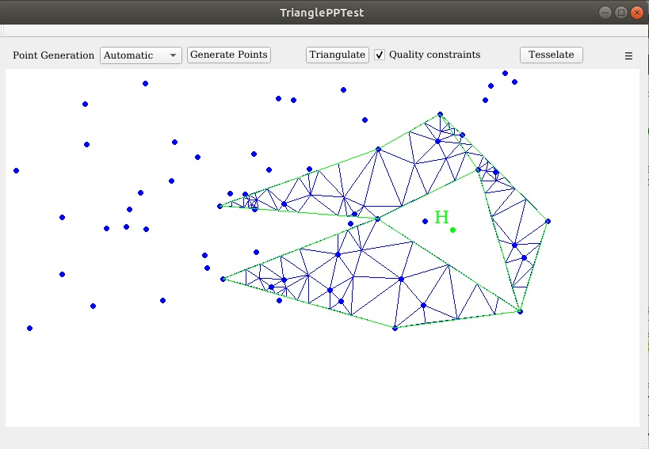
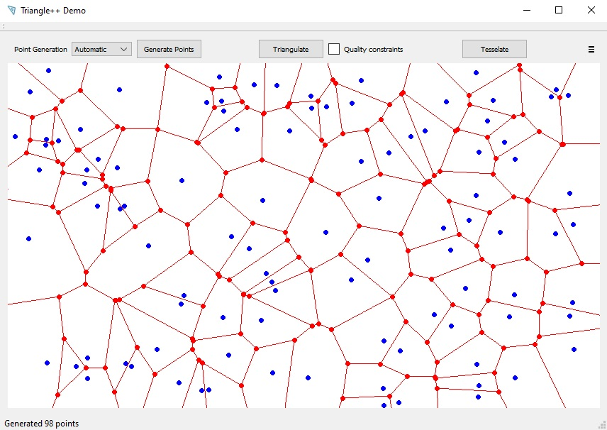
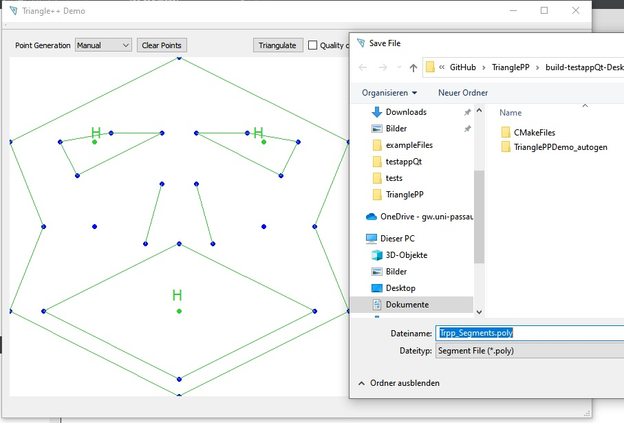

# Triangle++
[comment]: # "  "
 *Triangle++* (aka *TrianglePP*) is an updated version of Piyush Kumar's [C++/OO wrapper](https://bitbucket.org/piyush/triangle/overview) for the original 2005 J.P. Shevchuk's *Triangle* package that was written in old plain C.

It can create standard **Delaunay** triangulations, **quality Delaunay** triangulations, **constrained Delaunay** triangulations and **Voronoi** diagrams.

I have ported the original wrapper to Visual C++ (VisualStudio 2008/Win32), done some bugfixes, and extended it for constrainied triangulations and Voronoi diagrams. 

This code is released under LPGL licence.

## Update:

The code is now ported to x64 Windows. The project file was updated to Visual Studio 2015/2019, the x64 target was added, and the asserts & crashes when running the example program were fixed.

*CMake* support for both the example program and the GUI demonstrator were added later on and they work on both Linux and Windows. Also some basic Catch2 tests were added.

Support for reading and writing of *Triangle*'s file formats and input data sanitizarion were also added recently.

## Usage:

For usage patterns see the examples in the *trpp_example.cpp* source file. The interface of the *trpp*-wrapper is defined in the *tpp_inteface.hpp* header file. A (very) basic usage example is shown in the code snippet below:

    // prepare input
    std::vector<Delaunay::Point> delaunayInput;
    
    delaunayInput.push_back(Delaunay::Point(0,0));
    delaunayInput.push_back(Delaunay::Point(1,1));
    delaunayInput.push_back(Delaunay::Point(0,2));
    delaunayInput.push_back(Delaunay::Point(3,3));

    // use standard triangulation
    Delaunay trGenerator(delaunayInput);
    trGenerator.Triangulate();

    // iterate over triangles
    for (FaceIterator fit = trGenerator.fbegin(); fit != trGenerator.fend(); ++fit)
    {
        int vertexIdx1 = fit.Org(); 
        int vertexIdx2 = fit.Dest();
        int vertexIdx3 = fit.Apex();

        // access point's cooridinates: 
        double x1 = delaunayInput[vertexIdx1][0];
        double y1 = delaunayInput[vertexIdx1][1];
    }

For more examples consult the docs directory.

## Demo App:

Additionally, under *testappQt* you'll find a GUI programm to play with the triangulations:

quality triangulations:

constrained triangulations:

(also with holes!):

(also without enclosing convex hull):

and with tesselations:

You can also save and read your work:

## Original Triangle package

 

This code is a wrapper for the original 2005 J.P. Shevchuk's *Triangle* package that was written in old plain C. The library was a **winner** of the 2003 James Hardy Wilkinson Prize in Numerical Software (sic!).
For more information you can look at:
 - http://www.cs.cmu.edu/~quake/triangle.html
 - README in the docs directory

## TODOs:
 - remove warnings
 - add support for regions and reading of region attributes from .poly file
 - Add support for all options in constrained triangulations (Steiner point constraints, regions, etc) (???)
 - add support for refining of triangulations (?)
 - add support for saving Voronoi meshes 
 - add CI support (Travis?)
 - Port the Qt demo app to Emscripten
 - add convex hull demonstration to the Qt demo app (??)
